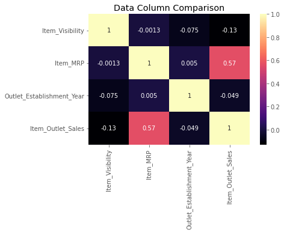
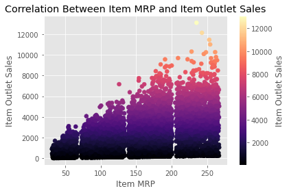
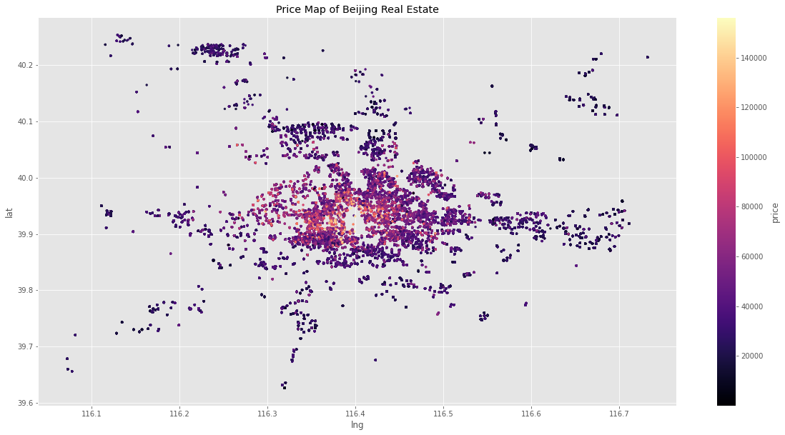
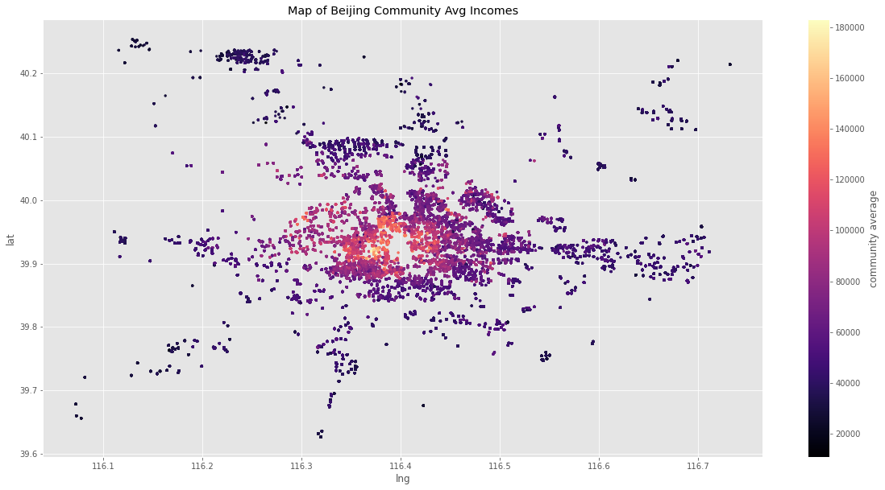

# Sales Predictions based on Item MRP
## Through out this project I will be analyzing the correlation between items sold and item MRP.
**Cheyenne Quann**: 
### Business problem: How can we increase total item outlet sales for this company?
### Data: 
The data used to make my analysis is
 /content/drive/MyDrive/Coding Dojo/DataSets/sales_predictions.csv. This dataset contains all pertinent information about the undisclosed company's sales that will be used in my study.
  Methods:
- Data preparation steps with explanation and justification for choices
- I will familiarize myself with the data by going through it extensively 
- The data will be cleaned to allow for cleaner processing, readability and analysis
-I will check correlations and create visuals for presentation purposes
- I will implement machine learning models that would best be able to predict the future of undisclosed company's sales based off of the provided data 
-I will recommend the best model to use depending on the bias and variance present in my chosen regression models
## Results
#### Data Column Correlation

This is where I was able to decipher that Item MRP had the strongest correlation to the Item Sales.

## Model
I chose to implement a linear regression model
to make predictions based on the dataset with which I conducted my project. I believe that it yields the best with with minimal error based on its R2 metric.The Linear Regression model has a 57% percent R2 score and has been shown to present a good fit 
## Recommendations:
Based on my research the recommendation is to increase the Item MRP of the products being sold to increase the sale of these same products.
## Limitations & Next Steps
The limitations to this project were not knowing the specific company selling the products,the prices of said products demographics they serve and who their competition in the given areas are.
My next steps are to gather intel about surrounding companies in the same industry as well as the people that live in the neighborhood.
### For further information
For any additional questions, please contact **Cheyenne.quann@gmail.com**

# Beijing Housing Predictions base on community average income and current housing market
##Throughout this project I will be exploring and visualizing the positive correlation between housing prices and community income.
**Cheyenne Quann**: 
### Business problem: How can we predict where the highest priced listings will present themselves as to increase our monthly commission as an agency
### Data: 
The data used to make my analysis is
/content/drive/MyDrive/Coding Dojo/DataSets/200khouses.csv This dataset contains all pertinent information about Beijing's housing market, coordinates of each house and the average incomes of every community present in the dataset
  Methods:
- Data preparation steps with explanation and justification for choices
- I will familiarize myself with the data by going through it extensively 
- The data will be cleaned to allow for cleaner processing, readability and analysis
-I will check correlations and create visuals for presentation purposes
- I will implement machine learning models that would best be able to predict where the highest paying listings are concentrated based off of the provided data 
-I will recommend the best model to use depending on how well fit my evaluation metrics are in my chosen regression models
## Results
 
 
## Analysis of visuals
My plots show a map of the Beijing communities coloring each point by price of homes in the first plot and by the aver community income in the second plot.
My first observation was that of coure the maps are identical but the community average income plot differs from the price map plot in that toward the center of the plot there is a higher concentration of high incomes.
The closer one moves to 39.9 lat, 116.4 lng the more expensive the homes. Thus visualizing what my correlation plot plots have may clear. There is a strong positive correlation between the prices of the homes and the incomes of the people that live in those communities.
## Recommendations:
Based on my findings, I believe any agency that wants to up their revenue and holdings should invest their time and energy into acquiring clients from these neighborhoods in the center of my plot.
## Limitations & Next Steps
The limitations to this project are that I don't have a way of knowing if the people that reside in the lightly colored center area are interested in selling. Given the density of wealth it is possible the families have been there a long time, they may be afflueent and intent on maintaining their property. My next steps would be to canvas the areas and find out just what kind of communities they are and how attached to the land are the people in the communities I've studied.
### For further information
For any additional questions, please contact **Cheyenne.quann@gmail.com**
